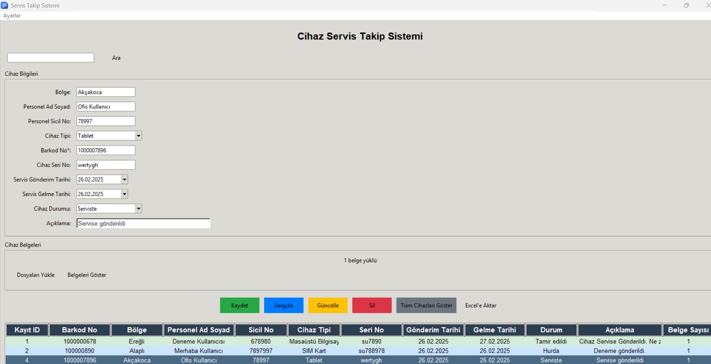
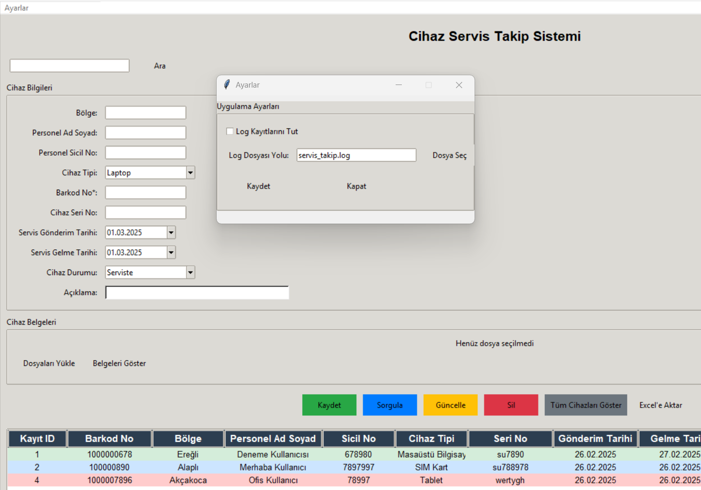
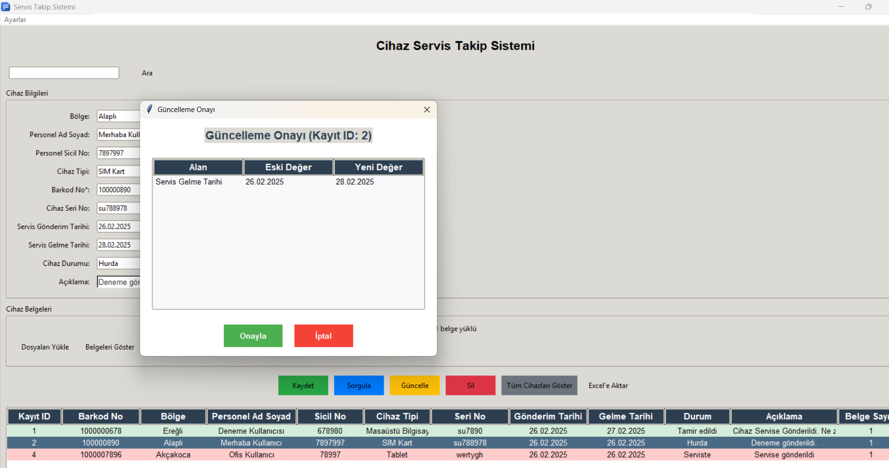

# Servis Takip Sistemi

-- Yapay Zeka araçları ile oluşturulmuştur.
Grok
Claude 3.7 Sonnet


Servis Takip Sistemi, kurum içi cihazların servis süreçlerini takip etmek için geliştirilmiş bir masaüstü uygulamasıdır. Uygulama, cihazların servis gönderim ve dönüş tarihlerini, durumlarını, belgeleri ve diğer detayları kaydetmenize, güncellemenize ve sorgulamanıza olanak sağlar.





## Özellikler

- **Cihaz Kayıtları:** Cihaz bilgilerini ve servis durumlarını kaydetme
- **Doküman Yönetimi:** Cihazlara ait belgeleri yükleme ve yönetme
- **Arama ve Filtreleme:** Barkod, personel adı ve diğer kriterlere göre arama
- **Gelişmiş Sorgulama:** Çoklu kriterlere göre cihaz sorgulama
- **Excel Entegrasyonu:** Kayıtları Excel dosyasına aktarma
- **Kullanıcı Dostu Arayüz:** Kolay kullanılabilir grafiksel arayüz
- **Loglama:** Sistem işlemlerinin kaydedilmesi

## Gereksinimler

- Python 3.7 veya üzeri
- Gerekli Python kütüphaneleri:
  - tkinter
  - tkcalendar
  - pandas
  - sqlite3 (Python ile birlikte gelir)

## Kurulum

1. Depoyu klonlayın:
   ```
   git clone https://github.com/expday/servis_takip.git
   cd servis_takip
   ```

2. Gerekli kütüphaneleri yükleyin:
   ```
   pip install -r requirements.txt
   ```

3. Uygulamayı çalıştırın:
   ```
   python servis_takip.py
   ```

## Kullanım

### Yeni Cihaz Kaydı
1. Cihaz bilgilerini ilgili alanlara girin
2. Barkod numarası zorunludur
3. İsterseniz cihaza ait belgeleri yükleyin
4. "Kaydet" butonuna tıklayın

### Cihaz Sorgulama
1. Üst kısımdaki arama kutusu ile hızlı arama yapabilirsiniz
2. Gelişmiş sorgulama için "Sorgula" butonunu kullanın
3. "Tüm Cihazları Göster" ile kayıtlı cihazları listeleyebilirsiniz

### Kayıt Güncelleme
1. Listeden güncellenecek cihaza çift tıklayın
2. Bilgileri güncelleyin
3. "Güncelle" butonuna tıklayın
4. Değişiklikleri onaylayın

### Excel'e Aktarma
1. Listeyi görüntüleyin
2. "Excel'e Aktar" butonuna tıklayın

## Veri Yapısı

Sistem aşağıdaki verileri kaydeder:
- Bölge
- Personel ad ve soyadı
- Personel sicil numarası
- Cihaz tipi
- Barkod numarası
- Cihaz seri numarası
- Servis gönderim tarihi
- Servis gelme tarihi
- Cihaz durumu
- Açıklama
- Cihaz belgeleri

## Ayarlar

Uygulama ayarlarını düzenlemek için üst menüdeki "Ayarlar" seçeneğini kullanabilirsiniz:
- Log kaydı etkinleştirme/devre dışı bırakma
- Log dosya yolunu değiştirme

## Destek ve İletişim

tacettinkaradeniz{@}proton.me

## Lisans

Bu proje [MIT Lisansı](LICENSE) altında lisanslanmıştır.
